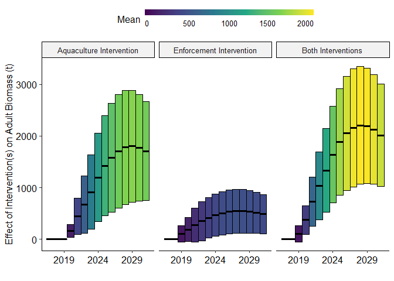
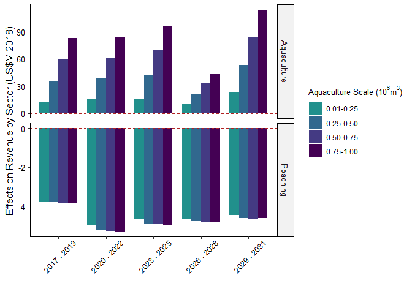

Commercializing aquaculture to conserve totoaba
================

  - [Packages](#packages)
  - [Data](#data)
  - [Functions](#functions)
  - [Set-Up for Model Runs](#set-up-for-model-runs)
  - [Model Runs](#model-runs)
  - [Visualizing Biological Impacts](#visualizing-biological-impacts)
  - [Visualizing Economic Impacts](#visualizing-economic-impacts)
  - [Visualizing Influence of Demand and
    Substitution](#visualizing-influence-of-demand-and-substitution)
  - [Visualizing Principal
    Components](#visualizing-principal-components)
  - [Summarizing Results](#summarizing-results)

# Packages

``` r
library(janitor)
library(broom)
library(reshape2)
library(ggpubr)
library(ggbiplot)
library(viridis)
library(factoextra)
library(tidyverse)
```

# Data

``` r
# Parameters from several sources noted in the file.
dat_par = read_csv("./data/dat_pars.csv") %>% 
  clean_names()

# Prices and characteristics of buche in end markets. Several sources.
dat_p = read_csv("./data/dat_p.csv")

#  Marginal mortalities per month in aquaculture from Cygnus Ocean Farms (2017).
dat_aqm = read_csv("./data/dat_aqm.csv") 

#  Biomass at age for 2017 from INAPESCA (2018).
dat_bio = read_csv("./data/dat_bio.csv")
```

# Functions

``` r
# Ages to lengths - Von Bertalanffy Growth Function.
fun_a_l = function(a, linf, k, t0){l = linf * (1 - exp(-k * (a - t0)))}

# Lengths to weights.
fun_l_w = function(a, l, b){w = a * l ^ b}

# Ages to natural mortalities.
fun_a_nmort = function(a, a_mat, a_old, m_juv, m_mat, m_old){s = 1 - ifelse(a < a_mat, 
                                                                            exp(-m_juv), 
                                                                            ifelse(a < a_old, 
                                                                                   exp(-m_mat), 
                                                                                   exp(-m_old)))}

# Lengths to selectivities.
fun_l_s = function(l, a, b, m){s = a / (1 + exp(b - m * l))}

# Ages to bycatch mortalities.
fun_a_bmort = function(a, b_b, a_mat, n0){b = ifelse(a < a_mat, 
                                                     b_b / floor(a_mat) / n0[floor(a_mat)],  
                                                     0)}

#(b_b / round(a_mat)) / n0[round(a_mat)], 0)} The code in use is a Band-Aid. Bycatch = 0.2 for a < a_mat.

# Numbers at age to recruitment - Shepherd Recruitment Function.
fun_rec = function(n, a_rec, b_rec, d_rec, f1_rec, f2_rec)
  
{n0 = ifelse((a_rec * n) / (1 + (n / b_rec) ^ d_rec) * exp(f1_rec * f2_rec) > 0, 
             (a_rec * n) / (1 + (n / b_rec) ^ d_rec) * exp(f1_rec * f2_rec),
             0)}

# Production and grams to price in multivariate inverse demand specification.
#  Deprecated nonlinear option.
# fun_p = function(q, g, a_ma, b_ma, c_ma){p = q * a_ma + g ^ b_ma + c_ma
#                                          return(ifelse(p > 0, p, 0))}
#  Linear option.
fun_p = function(q, g, a_ma, b_ma, c_ma)
  
  {
  
  p = q * a_ma + g * b_ma + c_ma
  return(ifelse(p > 0, p, 0))
  
  }

# Ages to natural mortalities in aquaculture.
fun_a_aqmort = function(a, b1, b2, mmin){m = b1 * exp(b2 * a * 12) + mmin}

# Weights to optimal stocking densities in numbers.
fun_ns = function(cage_size, dens, w){ns = (cage_size * dens) / w}

# The whole hog.
fun = function(par){
  
  # Name inputs.
  for(i in 1:nrow(par)){assign(rownames(par)[i], par[i,])}
  # Run intermediate set-up.
  #  Fishery.
  #   Numbers in 2017.
  n0 = dat_bio$n * nprop
  #   Catchability.
  # F = qENS > q = F / ENS; N is in numbers, F is in tonnes, and S is in proportions, so conversions are in order.
  q = 1000 * f_2017 / sum(n0 * fun_l_w(a_lw, fun_a_l(seq(a_0, a_i), linf_al, k_al, t0_al), b_lw) * fun_l_s(fun_a_l(seq(a_0, a_i), linf_al, k_al, t0_al), a_ls, b_ls, m_ls) * e_2017)
  #  Aquaculture.
  #   Cohort count at first saleable size is the ratio of density in kgm^-3 to size in kg.
  nsale = fun_ns(cage_size, dens, sale_size)
  #   Initial cohort count is density at first saleable size, plus cumulative mortality at first saleable age.
  #   Casually, nstart = nsale + mort(a(l(wsale))).
  #   Cumulative mortality to first saleable age:
  a_sale = (t0_al - 1 / k_al * (log(1 - ((sale_size / a_lw) ^ (1 / b_lw)) / linf_al))) # Inverse Von Bertalanffy.
  #   Initial stock to reach optimal density at first salable size:
  nstart = nsale * (100 / (100 - fun_a_aqmort(a_sale, b1_mort, b2_mort, mmin))) ^ a_sale
  
  # Build objects to fill.
  #  Fishery.
  n = matrix(nrow = t_i - t_0 + 1, ncol = a_i - a_0 + 1) # Build a matrix of numbers at age.
  m = matrix(nrow = t_i - t_0 + 1, ncol = a_i - a_0 + 1) # Build a matrix of natural mortalities at age.
  b = matrix(nrow = t_i - t_0 + 1, ncol = a_i - a_0 + 1) # Build a matrix of bycatch at age.
  y = matrix(nrow = t_i - t_0 + 1, ncol = a_i - a_0 + 1) # Build a matrix of catch at age.
  g = matrix(nrow = t_i - t_0 + 1, ncol = a_i - a_0 + 1) # Build a matrix of ghost catch at age.
  p_mat = matrix(nrow = t_i - t_0 + 1, ncol = a_i - a_0 + 1) # Build a matrix of prices at age.
  a_matrix = matrix(nrow = a_i - a_0 + 1, ncol = t_i - t_0 + 1) # Build a matrix of ages for reference in functions. Transposed.
  rec = as.numeric(vector(length = t_i - t_0 + 1))  # Build a vector of recruitment at age.
  e = as.numeric(vector(length = t_i - t_0 + 1))  # Build a vector of effort. This is the variable for optimization in the economic component.
  r_fi = as.numeric(vector(length = t_i - t_0 + 1))  # Build a vector of total revenues.
  c_fi = as.numeric(vector(length = t_i - t_0 + 1))  # Build a vector of total costs.
  #  Aquaculture.
  #   Current.
  a0_aq = matrix(nrow = t_i - t_0 + 1, ncol = c_cages) # Ages of stock.
  w0_aq = matrix(nrow = t_i - t_0 + 1, ncol = c_cages) # Weights.
  nm0_aq = matrix(nrow = t_i - t_0 + 1, ncol = c_cages)# Mortalities.
  ns0_aq = matrix(nrow = t_i - t_0 + 1, ncol = c_cages)# Survivors.
  nt0_aq = matrix(nrow = t_i - t_0 + 1, ncol = c_cages)# Trimming.
  n0_aq = matrix(nrow = t_i - t_0 + 1, ncol = c_cages) # Leftovers.
  rt0_aq = matrix(nrow = t_i - t_0 + 1, ncol = c_cages)# Revenues, trimming.
  p0_aq = matrix(nrow = t_i - t_0 + 1, ncol = c_cages) # Prices, maw.
  r0_aq = matrix(nrow = t_i - t_0 + 1, ncol = c_cages) # Revenues, maw.
  c0_aq = matrix(nrow = t_i - t_0 + 1, ncol = c_cages) # Costs.
  #   Led.
  a1_aq = matrix(nrow = t_i - t_0 + 1, ncol = c_cages)
  w1_aq = matrix(nrow = t_i - t_0 + 1, ncol = c_cages)
  nm1_aq = matrix(nrow = t_i - t_0 + 1, ncol = c_cages)
  ns1_aq = matrix(nrow = t_i - t_0 + 1, ncol = c_cages)
  nt1_aq = matrix(nrow = t_i - t_0 + 1, ncol = c_cages)
  n1_aq = matrix(nrow = t_i - t_0 + 1, ncol = c_cages)
  rt1_aq = matrix(nrow = t_i - t_0 + 1, ncol = c_cages)
  p1_aq = matrix(nrow = t_i - t_0 + 1, ncol = c_cages)
  r1_aq = matrix(nrow = t_i - t_0 + 1, ncol = c_cages)
  c1_aq = matrix(nrow = t_i - t_0 + 1, ncol = c_cages)
  #   Outputs.
  h_aq = matrix(nrow = t_i - t_0 + 1, ncol = c_cages)    # Decision.
  hinv_aq = matrix(nrow = t_i - t_0 + 1, ncol = c_cages) # Decision, inverse.
  r_aq = matrix(nrow = t_i - t_0 + 1, ncol = c_cages)    # Revenues.
  c_aq = matrix(nrow = t_i - t_0 + 1, ncol = c_cages)    # Costs.
  y_aq = matrix(nrow = t_i - t_0 + 1, ncol = c_cages)    # Production, wet tonnes.

  # Add initial values.
  #  Fishery.
  a_matrix[, 1:(t_i - t_0 + 1)] = seq(a_0, a_i) # Matrix of ages.
  a_matrix = t(a_matrix) # Transposing matrix of ages.
  n[1,] = n0 # Age distribution for first year, e.g. 2017.
  m[1,] = n[1,] * fun_a_nmort(a_matrix[1,], a_mat_am, a_old_am, m_juv_am, m_mat_am, m_old_am) # Natural mortalities.
  b[1,] = (n[1,] - m[1,]) * fun_a_bmort(a_matrix[1,], b_b, a_mat_am, n0) # Bycatch mortalities by cohort for first year.
  e[1] = e_2017 # Effort in boats/season for 2017.
  y[1,] = (n[1,] - m[1,] - b[1,]) * q * e[1] * fun_l_s(fun_a_l(a_matrix[1,], linf_al, k_al, t0_al), a_ls, b_ls, m_ls) # Catch for first year by cohort.
  g[1,] = (n[1,] - m[1,] - b[1,] - y[1,]) * g_r * q * e[1] * fun_l_s(fun_a_l(a_matrix[1,], linf_al, k_al, t0_al), a_ls, b_ls, m_ls) # Catch for first year by cohort.
  p_mat[1,] = fun_p(sum(fun_l_w(a_lw, fun_a_l(a_matrix[1, ], linf_al, k_al, t0_al), b_lw) * y[1, ] * by1 * by2) / 1000, # Prices from tonnes of production and grams of maw at age. Placeholder names.
                    fun_l_w(a_lw, fun_a_l(a_matrix[1, ], linf_al, k_al, t0_al), b_lw) * by1 * by2 * 1000,
                    a_ma, b_ma, c_ma) * loss
  r_fi[1] = sum(p_mat[1,] * fun_l_w(a_lw, fun_a_l(a_matrix[1, ], linf_al, k_al, t0_al), b_lw) * y[1, ] * by1 * by2 * 1000) # Constant for conversion to grams of buche.
  c_fi[1] = e[1] * c_2017 + e[1] * switch_en * multi_en * c_enf # Costs for first year. Vessel costs, crew shares of profit, and enforcement intensification.
  rec[1] = fun_rec(sum(n[1, 4:(a_i - a_0 + 1)]), a_r, b_r, d_r, f1_r, f2_r) # Recruitment for first year. Start of column designation is hard-coded.
  eta = (e[1] * eta_limit) / abs(r_fi[1] - c_fi[1]) # Parameter to restrict changes in effort.

  #  Aquaculture.
  #   Current.
  # a0_aq[1,] = round(runif(c_cages, 0, ceiling(a_sale))) # Ages set from random uniform distribution.
  a0_aq[1,] = rep(ceiling(a_sale), c_cages) # Ages set to first harvest.
  w0_aq[1,] = fun_l_w(a_lw, fun_a_l(a0_aq[1,], linf_al, k_al, t0_al), b_lw)
  nm0_aq[1,] = nstart * (0.01 * fun_a_aqmort(a0_aq[1,], b1_mort, b2_mort, mmin))
  ns0_aq[1,] = nstart * (1 - 0.01 * fun_a_aqmort(a0_aq[1,], b1_mort, b2_mort, mmin)) # Note leading mortality.
  nt0_aq[1,] = ifelse(ns0_aq[1,] - fun_ns(cage_size, dens, w0_aq[1,]) > 0,
                      ns0_aq[1,] - fun_ns(cage_size, dens, w0_aq[1,]),
                      0)
  n0_aq[1,] = nstart - nm0_aq[1,] - nt0_aq[1,]
  #for(j in 1:c_cages){p0_aq[1, j] = p_mat[1, a0_aq[1, j]] * 1000} # Looping to enable position references in the price matrix.
  p0_aq[1,] = rep(10, c_cages) # Watch out for this Band-Aid.
  rt0_aq[1,] = nt0_aq[1,] * w0_aq[1,] * by1 * by2 * p0_aq[1,] * switch_aq + nt0_aq[1,] * w0_aq[1,] * wy * wp # Trimming revenues for maw and wet product. Fix placeholder names.
  r0_aq[1,] = w0_aq[1,] * n0_aq[1,] * by1 * by2 * n0_aq[1,] * p0_aq[1,] * switch_aq + n0_aq[1,] * w0_aq[1,] * wy * wp # Harvest revenues for maw and wet product. Fix placeholder names.
  c0_aq[1,] = n0_aq[1,] * fun_l_w(a_lw, fun_a_l(a0_aq[1,] - 0.5, linf_al, k_al, t0_al), b_lw) * feed_prop * feed_cost * 365 # Fix placeholder variable names.

  #   Led.
  a1_aq[1,] = a0_aq[1,] + 1
  w1_aq[1,] = fun_l_w(a_lw, fun_a_l(a1_aq[1,], linf_al, k_al, t0_al), b_lw)
  # Since this implementation of mortality/survival and trimming require iteration to work, the corresponding lead variables are spaghetti.
  nm1_aq[1,] = (nstart * (1 - 0.01 * fun_a_aqmort(a1_aq[1,] - 1, b1_mort, b2_mort, mmin)) -
                 ifelse(nstart * (1 - 0.01 * fun_a_aqmort(a1_aq[1,] - 1, b1_mort, b2_mort, mmin) - fun_ns(cage_size, dens, w1_aq[1,])) > 0,
                        nstart * (1 - 0.01 * fun_a_aqmort(a1_aq[1,] - 1, b1_mort, b2_mort, mmin) - fun_ns(cage_size, dens, w1_aq[1,])),
                        0)) * (0.01 * fun_a_aqmort(a1_aq[1,], b1_mort, b2_mort, mmin))
  ns1_aq[1,] = (nstart * (1 - 0.01 * fun_a_aqmort(a1_aq[1,] - 1, b1_mort, b2_mort, mmin)) -
                 ifelse(nstart * (1 - 0.01 * fun_a_aqmort(a1_aq[1,] - 1, b1_mort, b2_mort, mmin) - fun_ns(cage_size, dens, w1_aq[1,])) > 0,
                        nstart * (1 - 0.01 * fun_a_aqmort(a1_aq[1,] - 1, b1_mort, b2_mort, mmin) - fun_ns(cage_size, dens, w1_aq[1,])),
                        0)) * (1 - 0.01 * fun_a_aqmort(a1_aq[1,], b1_mort, b2_mort, mmin))
  nt1_aq[1,] = ifelse(ns1_aq[1,] - fun_ns(cage_size, dens, w1_aq[1,]), ns1_aq[1,] - fun_ns(cage_size, dens, w1_aq[1,]), 0)
  n1_aq[1,] = fun_ns(cage_size, dens, w1_aq[1,])
  p0_aq[1,] = rep(10, c_cages)
  #for(j in 1:c_cages){p0_aq[1, j] = p_mat[1, a0_aq[1, j]] * 1000} # Looping to enable position references in the price matrix.
  rt1_aq[1,] = nt1_aq[1,] * w1_aq[1,] * by1 * by2 * p1_aq[1,] * switch_aq + nt1_aq[1,] * w1_aq[1,] * wy * wp # Trimming revenues for maw and wet product. Fix placeholder names.
  r1_aq[1,] = w1_aq[1,] * n1_aq[1,] * by1 * by2 * n1_aq[1,] * p1_aq[1,] * switch_aq + n1_aq[1,] * w1_aq[1,] * wy * wp # Harvest revenues for maw and wet product. Fix placeholder names.
  c1_aq[1,] = n1_aq[1,] * fun_l_w(a_lw, fun_a_l(a1_aq[1,] - 0.5, linf_al, k_al, t0_al), b_lw) * feed_prop * feed_cost * 365 # Fix placeholder variable names.

  h_aq[1,] = 0
  hinv_aq[1,] = 1

  r_aq[1,] = r0_aq[1,] * h_aq[1,] + rt0_aq[1,] * hinv_aq[1,]
  c_aq[1,] = c0_aq[1,] * hinv_aq[1,] + fry * nstart * h_aq[1,] + over
  y_aq[1,] = n0_aq[1,] * w0_aq[1,] * h_aq[1,] + nt0_aq[1,] * w0_aq[1,] * hinv_aq[1,]

  # Add iterations.
  for(i in 2:(t_i - t_0 + 1)){
    for(j in 2:(a_i - a_0 + 1)){
      # Fishery.
      #  Numbers for time i and cohort j are numbers of the previous time and cohort less mortalities of the previous time and cohort.
      n[i, j] = ifelse(n[i - 1, j - 1] - m[i - 1, j - 1] - b[i - 1, j - 1] - y[i - 1, j - 1] - g[i - 1, j - 1] > 0,
                       n[i - 1, j - 1] - m[i - 1, j - 1] - b[i - 1, j - 1] - y[i - 1, j - 1] - g[i - 1, j - 1],
                       0)

      #  Natural mortalities for time i and cohort j are numbers for the same multipled by a constant factor for marginal mortality.
      m[i, j] = n[i, j] * fun_a_nmort(a_matrix[i, j], a_mat_am, a_old_am, m_juv_am, m_mat_am, m_old_am)

      #  Bycatch for time i and cohort j are numbers for the same after natural mortality multipled by constant bycatch mortality..
      b[i, j] = (n[i, j] - m[i, j]) * fun_a_bmort(a_matrix[i, j], b_b, a_mat_am, n0)

    }

    #  Numbers for time i and first cohort.
    n[i, 1] = rec[i - 1]

    #  Natural mortalities for time i and first cohort.
    m[i, 1] = n[i, 1] * fun_a_nmort(a_matrix[i, 1], a_mat_am, a_old_am, m_juv_am, m_mat_am, m_old_am)

    #  Bycatch mortality for time i and first cohort.
    b[i, 1] = (n[i, 1] - m[i, 1]) * fun_a_bmort(a_matrix[i, 1], b_b, a_mat_am, n0)

    # Effort for time i and all cohorts from past effort, revenues, costs, and a stiffness parameter.
    e[i] = ifelse(e[i - 1] + eta * (r_fi[i - 1] - c_fi[i - 1]) > 0,
                  e[i - 1] + eta * (r_fi[i - 1] - c_fi[i - 1]),
                  0) # Bound positive.

    #  Catches from effort and the rest.
    for(j in 2:(a_i - a_0 + 1)){
      y[i, j] = ifelse((n[i, j] - m[i, j] - b[i, j]) * q * e[i] * fun_l_s(fun_a_l(a_matrix[i, j], linf_al, k_al, t0_al), a_ls, b_ls, m_ls) > 0,
                       (n[i, j] - m[i, j] - b[i, j]) * q * e[i] * fun_l_s(fun_a_l(a_matrix[i, j], linf_al, k_al, t0_al), a_ls, b_ls, m_ls),
                       0)
      y[i, 1] = ifelse((n[i, 1] - m[i, 1] - b[i, 1]) * q * e[i] * fun_l_s(fun_a_l(a_matrix[i, 1], linf_al, k_al, t0_al), a_ls, b_ls, m_ls) > 0,
                       (n[i, 1] - m[i, 1] - b[i, 1]) * q * e[i] * fun_l_s(fun_a_l(a_matrix[i, 1], linf_al, k_al, t0_al), a_ls, b_ls, m_ls),
                       0)
    }

    #  Ghost catches from past effort, etc.
    for(j in 2:(a_i - a_0 + 1)){
      g[i, j] = ifelse((n[i, j] - m[i, j] - b[i, j] - y[i, j]) * g_r * q * e[i - 1] * fun_l_s(fun_a_l(a_matrix[i, j], linf_al, k_al, t0_al), a_ls, b_ls, m_ls) > 0,
                       (n[i, j] - m[i, j] - b[i, j] - y[i, j]) * g_r * q * e[i - 1] * fun_l_s(fun_a_l(a_matrix[i, j], linf_al, k_al, t0_al), a_ls, b_ls, m_ls),
                       0)
      g[i, 1] = ifelse((n[i, 1] - m[i, 1] - b[i, 1] - y[i, j]) * g_r * q * e[i - 1] * fun_l_s(fun_a_l(a_matrix[i, 1], linf_al, k_al, t0_al), a_ls, b_ls, m_ls) > 0,
                       (n[i, 1] - m[i, 1] - b[i, 1] - y[i, j]) * g_r * q * e[i - 1] * fun_l_s(fun_a_l(a_matrix[i, 1], linf_al, k_al, t0_al), a_ls, b_ls, m_ls),
                       0)
    }

    #  Recruitment for time i.
    rec[i] = fun_rec(sum(n[i, 4:(a_i - a_0 + 1)]), a_r, b_r, d_r, f1_r, f2_r)

    # Aquaculture.
    a0_aq[i,] = a0_aq[i - 1,] * hinv_aq[i - 1,] + 1
    w0_aq[i,] = fun_l_w(a_lw, fun_a_l(a0_aq[i,], linf_al, k_al, t0_al), b_lw)
    nm0_aq[i,] = (nstart * h_aq[i - 1,] + n0_aq[i - 1,] * hinv_aq[i - 1,]) * (0.01 * fun_a_aqmort(a0_aq[i,], b1_mort, b2_mort, mmin)) # Note leading mortality.
    ns0_aq[i,] = (nstart * h_aq[i - 1,] + n0_aq[i - 1,] * hinv_aq[i - 1,]) * (1 - 0.01 * fun_a_aqmort(a0_aq[i,], b1_mort, b2_mort, mmin)) # Note leading mortality.
    nt0_aq[i,] = ifelse(ns0_aq[i,] - fun_ns(cage_size, dens, w0_aq[i,]) > 0, ns0_aq[i,] - fun_ns(cage_size, dens, w0_aq[i,]), 0)
    n0_aq[i,] = (nstart * h_aq[i - 1,] + n0_aq[i - 1,] * hinv_aq[i - 1,]) - nm0_aq[i,] - nt0_aq[i,]
    p0_aq[i,] = p_mat[i - 1, a0_aq[i,]] * 1000 # Conversion for price in grams to revenue from kilograms of dry maw.
    rt0_aq[i,] = nt0_aq[i,] * w0_aq[i,] * by1 * by2 * p0_aq[i,] * switch_aq + nt0_aq[i,] * w0_aq[i,] * wy * wp # Trimming revenues.
    r0_aq[i,] = n0_aq[i,] * w0_aq[i,] * by1 * by2 * p0_aq[i,] * switch_aq + n0_aq[i,] * w0_aq[i,] * wy * wp # Harvest revenues.
    c0_aq[i,] = n0_aq[i,] * fun_l_w(a_lw, fun_a_l(a0_aq[i,] - 0.5, linf_al, k_al, t0_al), b_lw) * feed_prop * feed_cost * 365

    a1_aq[i,] = a0_aq[i,] + 1
    w1_aq[i,] = fun_l_w(a_lw, fun_a_l(a1_aq[i,], linf_al, k_al, t0_al), b_lw)
    nm1_aq[i,] = (nstart * h_aq[i - 1,] + n1_aq[i - 1,] * hinv_aq[i - 1,]) * (0.01 * fun_a_aqmort(a1_aq[i,], b1_mort, b2_mort, mmin)) # Note leading mortality.
    ns1_aq[i,] = (nstart * h_aq[i - 1,] + n1_aq[i - 1,] * hinv_aq[i - 1,]) * (1 - 0.01 * fun_a_aqmort(a1_aq[i,], b1_mort, b2_mort, mmin)) # Note leading mortality.
    nt1_aq[i,] = ifelse(ns1_aq[i,] - fun_ns(cage_size, dens, w1_aq[i,]) > 0, ns1_aq[i,] - fun_ns(cage_size, dens, w1_aq[i,]), 0)
    n1_aq[i,] = (nstart * h_aq[i - 1,] + n1_aq[i - 1,] * hinv_aq[i - 1,]) - nm1_aq[i,] - nt1_aq[i,]
    p1_aq[i,] = p_mat[i - 1, a1_aq[i,]] * 1000 # Conversion for price in grams to revenue from kilograms of dry maw.
    rt1_aq[i,] = nt1_aq[i,] * w1_aq[i,] * by1 * by2 * p1_aq[i,] * switch_aq + nt1_aq[i,] * w1_aq[i,] * wy * wp # Trimming revenues.
    r1_aq[i,] = n1_aq[i,] * w1_aq[i,] * by1 * by2 * p1_aq[i,] * switch_aq + n1_aq[i,] * w1_aq[i,] * wy * wp # Harvest revenues.
    c1_aq[i,] = n1_aq[i,] * fun_l_w(a_lw, fun_a_l(a1_aq[i,] - 0.5, linf_al, k_al, t0_al), b_lw) * feed_prop * feed_cost * 365

    h_aq[i,] = ifelse(a0_aq[i,] > ceiling(a_sale), # Wrapper for minimum sale age.
                     ifelse(r0_aq[i,] - fry * nstart > rt0_aq[i,] - c0_aq[i,] + disc * (r1_aq[i,] - fry * nstart), # Faustmann.
                            1,
                            0),
                     0)
    hinv_aq[i,] = (h_aq[i,] - 1) ^ 2

    y_aq[i,] = n0_aq[i,] * w0_aq[i,] * h_aq[i,] + nt0_aq[i,] * w0_aq[i,] * hinv_aq[i,]
    r_aq[i,] = r0_aq[i,] * h_aq[i,] + rt0_aq[i,] * hinv_aq[i,]
    c_aq[i,] = c0_aq[i,] * hinv_aq[i,] + fry * nstart * h_aq[i,] + over

    # Prices in matrix.
    for(j in 1:(a_i - a_0 + 1)){
      p_mat[i, j] = fun_p(sum(fun_l_w(a_lw, fun_a_l(a_matrix[i, ], linf_al, k_al, t0_al), b_lw) * y[i, ] * by1 * by2, # Fishery production.
                              (n0_aq[i,] * w0_aq[i,] * by1 * by2 * h_aq[i,] + nt0_aq[i,] * w0_aq[i,] * by1 * by2 * hinv_aq[i,]) * switch_aq * sub) # Aquaculture production.
                          / 1000, # Conversion to tonnes.
                          fun_l_w(a_lw, fun_a_l(a_matrix[i, j], linf_al, k_al, t0_al), b_lw) * by1 * by2,
                          a_ma,
                          b_ma,
                          c_ma * dem) * loss
      p_mat[i, j] = ifelse(p_mat[i, j] > 0, p_mat[i, j], 0)
    }

    # Revenues.
    r_fi[i] = sum(p_mat[i,] * fun_l_w(a_lw, fun_a_l(a_matrix[i, ], linf_al, k_al, t0_al), b_lw) * y[i, ] * by1 * by2 * 1000) # Constant for conversion to grams of buche.

    # Costs.
    c_fi[i] = e[i] * c_2017 + e[i] * switch_en * multi_en * c_enf
  }

  # Tidy results: numbers, recruitment, catches, effort, revenues, costs, profits.
  #  Numbers.
  tidyn = melt(n)
  tidyn$var = "Numbers"
  #  Catches.
  tidyy = melt(y)
  tidyy$var = "Catches"
  #  Poaching Profit.
  tidypi_fi = rename(data.frame(matrix(NA,
                                       nrow = t_i - t_0 + 1,
                                       ncol = 4)),
                     Var1 = X1,
                     Var2 = X2,
                     value = X3,
                     var = X4)
  tidypi_fi$Var1 = seq(1, t_i - t_0 + 1)
  tidypi_fi$Var2 = NA
  tidypi_fi$value = r_fi - c_fi
  tidypi_fi$var = "Poaching Profit"
  #  Poaching Revenue.
  tidyr_fi = rename(data.frame(matrix(NA,
                                       nrow = t_i - t_0 + 1,
                                       ncol = 4)),
                     Var1 = X1,
                     Var2 = X2,
                     value = X3,
                     var = X4)
  tidyr_fi$Var1 = seq(1, t_i - t_0 + 1)
  tidyr_fi$Var2 = NA
  tidyr_fi$value = r_fi
  tidyr_fi$var = "Poaching Revenue"
  # Aquaculture Profit.
  tidypi_aq = rename(data.frame(matrix(NA,
                                       nrow = t_i - t_0 + 1,
                                       ncol = 4)),
                     Var1 = X1,
                     Var2 = X2,
                     value = X3,
                     var = X4)
  tidypi_aq$Var1 = seq(1, t_i - t_0 + 1)
  tidypi_aq$Var2 = NA
  tidypi_aq$value = rowSums(r_aq) - rowSums(c_aq)
  tidypi_aq$var = "Aquaculture Profit"
  # Aquaculture Revenue.
  tidyr_aq = rename(data.frame(matrix(NA,
                                       nrow = t_i - t_0 + 1,
                                       ncol = 4)),
                     Var1 = X1,
                     Var2 = X2,
                     value = X3,
                     var = X4)
  tidyr_aq$Var1 = seq(1, t_i - t_0 + 1)
  tidyr_aq$Var2 = NA
  tidyr_aq$value = rowSums(r_aq)
  tidyr_aq$var = "Aquaculture Revenue"
  #  Prices. Using prices for a 13y/o fish for easy reference. It's representativish.
  tidyp = rename(data.frame(matrix(NA,
                                   nrow = t_i - t_0 + 1,
                                   ncol = 4)),
                 Var1 = X1,
                 Var2 = X2,
                 value = X3,
                 var = X4)
  tidyp$Var1 = seq(1, t_i - t_0 + 1)
  tidyp$Var2 = NA
  tidyp$value = p_mat[, 13]
  tidyp$var = "Price"
  #  Poaching Effort.
  tidye = rename(data.frame(matrix(NA, nrow = t_i - t_0 + 1,
                                   ncol = 4)),
                 Var1 = X1,
                 Var2 = X2,
                 value = X3,
                 var = X4)
  tidye$Var1 = seq(1, t_i - t_0 + 1)
  tidye$Var2 = NA
  tidye$value = e
  tidye$var = "Effort"
  #  Poaching Cost per Metric Ton.
  tidyc_fi = rename(data.frame(matrix(NA,
                                       nrow = t_i - t_0 + 1,
                                       ncol = 4)),
                     Var1 = X1,
                     Var2 = X2,
                     value = X3,
                     var = X4)
  tidyc_fi$Var1 = seq(1, t_i - t_0 + 1)
  tidyc_fi$Var2 = NA
  tidyc_fi$value = c_fi / sum((fun_l_w(a_lw, fun_a_l(a_matrix[1,], linf_al, k_al, t0_al), b_lw) * y * by1 * by2) / 1000)
  tidyc_fi$var = "Poaching Cost per Metric Ton"
  #  Aquaculture Cost per Metric Ton.
  tidyc_aq = rename(data.frame(matrix(NA, nrow = t_i - t_0 + 1,
                                      ncol = 4)),
                    Var1 = X1,
                    Var2 = X2,
                    value = X3,
                    var = X4)
  tidyc_aq$Var1 = seq(1, t_i - t_0 + 1)
  tidyc_aq$Var2 = NA
  tidyc_aq$value = rowSums(c_aq, na.rm = TRUE) / ((rowSums(y_aq, na.rm = TRUE) * by1 * by2) / 1000) # Summing cages and converting from kilograms to tonnes.
  tidyc_aq$var = "Aquaculture Cost per Metric Ton"
  #  Everything!
  tidy = bind_rows(tidyn, tidyy, tidypi_fi, tidyr_fi, tidypi_aq, tidyr_aq, tidyp, tidye, tidyc_fi, tidyc_aq)
  tidy = rename(tidy, Year = Var1, Age = Var2, Result = value, Variable = var)
  
  # Get results.
  return(tidy)
  
}
```

# Set-Up for Model Runs

``` r
# Visualization
#  Set up palettes.
pal_fil = viridis(4, 
                  begin = 0.00, 
                  end = 0.50, 
                  direction = -1, 
                  option = "D",
                  alpha = 0.50)

pal_col = viridis(4, 
                  begin = 0.00, 
                  end = 0.50, 
                  direction = -1, 
                  option = "D")

# Market
#  Estimate inverse demand.
#   Nonlinear model doesn't really pay off, but here's the code anyhow.
# nlm = nls(p ~ q * a + (g ^ b) + c, 
#           data = dat_p, 
#           start = c(a = -5.00, b = 2.00, c = 20))

#   Linear model works fine.
lm_p = lm(p ~ q + g,
          data = dat_p)

#  Clean results.
lm_tidy = tidy(lm_p)

# Aquaculture
#  Estimate incremental mortalities.
#  Regression:
am_reg = nls(m_months ~ b1 * exp(b2 * a_months), dat_aqm, start = list(b1 = 8.00, b2 = - 1.00))
#  Clean results.
am_reg_tidy = tidy(am_reg)

# Pull initial and intermediate parameters together.
pars_full = dat_par %>%
  # Add market outputs to parameter table.
  add_row(name_long = "Quantity Elasticity", 
          name_short = "a_ma", 
          "function" = "Demand", 
          mid = lm_tidy$estimate[2], 
          low = lm_tidy$estimate[2] - lm_tidy$std.error[2], 
          high = lm_tidy$estimate[2] + lm_tidy$std.error[2], 
          units = NA, 
          module = "Fishery", 
          source1 = "Intermediate", 
          source2 = NA, 
          source3 = NA) %>% 
  add_row(name_long = "Size Premium", 
          name_short = "b_ma", 
          "function" = "Demand", 
          mid = lm_tidy$estimate[3], 
          low = lm_tidy$estimate[3] - lm_tidy$std.error[3], 
          high = lm_tidy$estimate[3] + lm_tidy$std.error[3], 
          units = NA, 
          module = "Fishery", 
          source1 = "Intermediate", 
          source2 = NA, 
          source3 = NA) %>%
  add_row(name_long = "Choke Price", 
          name_short = "c_ma", 
          "function" = "Demand", 
          mid = lm_tidy$estimate[1], 
          low = lm_tidy$estimate[1] - lm_tidy$std.error[1], 
          high = lm_tidy$estimate[1] + lm_tidy$std.error[1], 
          units = NA, 
          module = "Fishery", 
          source1 = "Intermediate", 
          source2 = NA, 
          source3 = NA) %>%
  # Add aquaculture outputs to parameter table.
  add_row(name_long = "Aq. Mortality Coefficient", 
          name_short = "b1_mort", 
          "function" = "Aquaculture Mortality", 
          mid = am_reg_tidy$estimate[1], 
          low = am_reg_tidy$estimate[1] + am_reg_tidy$std.error[1],
          high = am_reg_tidy$estimate[1] - am_reg_tidy$std.error[1], 
          units = NA, 
          module = "Aquaculture", 
          source1 = "Intermediate", 
          source2 = NA, 
          source3 = NA) %>%
  add_row(name_long = "Aq. Mortality Coefficient", 
          name_short = "b2_mort", 
          "function" = "Aquaculture Mortality", 
          mid = am_reg_tidy$estimate[2], 
          low = am_reg_tidy$estimate[2] + am_reg_tidy$std.error[2], 
          high = am_reg_tidy$estimate[2] - am_reg_tidy$std.error[2], 
          units = NA, 
          module = "Aquaculture", 
          source1 = "Intermediate", 
          source2 = NA, 
          source3 = NA)
    
# Turn parameters into a matrix for multiple model runs.
pars_base = pars_full %>% 
  select(2, 4:6) %>%
  column_to_rownames(var = "name_short")

# Define n runs.
n = 100

# Build n runs w/o aquaculture.
pars_0 = pars_base[1]
pars_0[2:n] = pars_0[1]

# Draws. 
#  Fishery.
pars_0["nprop", ] = rnorm(n, 
                          mean = 1, 
                          sd = 0.085)

pars_0["e_2017", ] = runif(n,
                           min = pars_base["e_2017", 2],
                           max = pars_base["e_2017", 3])

pars_0["c_2017", ] = runif(n,
                           min = pars_base["c_2017", 2],
                           max = pars_base["c_2017", 3])

pars_0["eta_limit", ] = runif(n,
                              min = pars_base["eta_limit", 2],
                              max = pars_base["eta_limit", 3])

pars_0["multi_en", ] = runif(n,
                           min = pars_base["multi_en", 2],
                           max = pars_base["multi_en", 3])

pars_0["c_enf", ] = runif(n,
                           min = pars_base["c_enf", 2],
                           max = pars_base["c_enf", 3])

pars_0["g_r", ] = runif(n,
                          min = pars_base["g_r", 2],
                          max = pars_base["g_r", 3])
 
#  Aquaculture.
pars_0["sale_size", 1:n] = runif(n,
                                    min = pars_base["sale_size", 2],
                                    max = pars_base["sale_size", 3])

pars_0["dens", 1:n] = runif(n,
                               min = pars_base["dens", 2],
                               max = pars_base["dens", 3])

pars_0["mmin", 1:n] = runif(n,
                               min = pars_base["mmin", 2],
                               max = pars_base["mmin", 3])

pars_0["disc", 1:n] = runif(n,
                               min = pars_base["disc", 2],
                               max = pars_base["disc", 3])

pars_0["c_cages", 1:n] = ceiling(runif(n,
                                       min = pars_base["c_cages", 2],
                                       max = pars_base["c_cages", 3]))

# Build n runs w/ aquaculture.
pars_1 = pars_0
pars_1["switch_aq", ] = 1
# Build n runs w/ increased enforcement.
pars_2 = pars_0
pars_2["switch_en", ] = 1
# Build n runs w/ aquaculture and increased enforcement.
pars_3 = pars_0
pars_3["switch_aq", ] = 1
pars_3["switch_en", ] = 1
```

# Model Runs

``` r
# House results.
results_0 = vector("list", n)
results_1 = vector("list", n)
results_2 = vector("list", n)
results_3 = vector("list", n)

# Loop through parameter sets.
for(i in 1:n){par = select(pars_0, i)
                    output = fun(par)
                    output$Run = i
                    output$Scenario = "Status Quo" # Band-Aid: This would be better outside of the loop.
                    output$Cages = par["c_cages",] # Band-Aid: This carries one parameter through, but compact code to carry all through would be nice.
                    results_0[[i]] = output}
```

    ## Note: Using an external vector in selections is ambiguous.
    ## i Use `all_of(i)` instead of `i` to silence this message.
    ## i See <https://tidyselect.r-lib.org/reference/faq-external-vector.html>.
    ## This message is displayed once per session.

``` r
for(i in 1:n){par = select(pars_1, i)
                    output = fun(par)
                    output$Run = i
                    output$Scenario = "Aquaculture Intervention" # Band-Aid: This would be better outside of the loop.
                    output$Cages = par["c_cages",] # Band-Aid: This carries one parameter through, but compact code to carry all through would be nice.
                    results_1[[i]] = output}

for(i in 1:n){par = select(pars_2, i)
                    output = fun(par)
                    output$Run = i
                    output$Scenario = "Enforcement Intervention" # Band-Aid: This would be better outside of the loop.
                    output$Cages = par["c_cages",] # Band-Aid: This carries one parameter through, but compact code to carry all through would be nice.
                    results_2[[i]] = output}

for(i in 1:n){par = select(pars_3, i)
                    output = fun(par)
                    output$Run = i
                    output$Scenario = "Aquaculture and Enforcement Interventions" # Band-Aid: This would be better outside of the loop.
                    output$Cages = par["c_cages",] # Band-Aid: This carries one parameter through, but compact code to carry all through would be nice.
                    results_3[[i]] = output}

# Go from list to dataframe for easier processing.
results = bind_rows(results_0,
                    results_1,
                    results_2,
                    results_3)
```

# Visualizing Biological Impacts

``` r
# Summarize results in barplots of differential outcomes wrt total reproductive biomass and biomass by cohort.
#  Reproductive biomass w/ aq. scale.
vis_bio_sum = 
  results %>% 
  filter(Variable == "Numbers" & Age > 3) %>% 
  mutate(Biomass = fun_l_w(pars_base["a_lw", 1], 
                           fun_a_l(Age - 0.5, 
                                   pars_base["linf_al", 1], 
                                   pars_base["k_al", 1], 
                                   pars_base["t0_al", 1]),  
                           pars_base["b_lw", 1]) / 1000 * Result) %>% 

  group_by(Year,
           Run, 
           Scenario) %>% 
  summarize(Biomass = sum(Biomass)) %>% 
  pivot_wider(names_from = Scenario,
              values_from = Biomass) %>% 
  mutate(`Aquaculture Intervention` = `Aquaculture Intervention` - `Status Quo`,
         `Enforcement Intervention` = `Enforcement Intervention` - `Status Quo`,
         `Aquaculture and Enforcement Interventions` = `Aquaculture and Enforcement Interventions` - `Status Quo`) %>% 
  select(-`Status Quo`) %>% 
  pivot_longer(cols = c("Aquaculture Intervention",
                        "Enforcement Intervention",
                        "Aquaculture and Enforcement Interventions"),
               names_to = "Scenario",
               values_to = "Values") %>% 
  group_by(Year,
           Scenario) %>% 
  summarize(Mid = mean(Values, na.rm = TRUE),
            High = mean(Values, na.rm = TRUE) + sd(Values, na.rm = TRUE),
            Low = mean(Values, na.rm = TRUE) - sd(Values, na.rm = TRUE)) %>% 
  ungroup %>% 
  mutate(Scenario = factor(Scenario, 
                           levels = c("Aquaculture Intervention",
                                      "Enforcement Intervention",
                                      "Aquaculture and Enforcement Interventions"),
                           labels = c("Aquaculture Intervention",
                                      "Enforcement Intervention",
                                      "Aquaculture and Enforcement Interventions"))) %>% 
  ggplot + 
  geom_crossbar(aes(x = Year + 2016,
                   y = Mid,
                   ymin = Low,
                   ymax = High,
                   group = Year + 2016,
                   fill = Mid),
                width = 1) +
  labs(x = "",
       y = "Effect of Aquaculture Exports on Spawning Fishery Biomass (Tonnes)",
       fill = "Mean") +
  scale_x_continuous(breaks = c(2019, 2024, 2029)) +
  scale_fill_viridis_c() +
  guides(fill = guide_colorbar(barwidth = 15,
                               barheight = 0.5,
                               ticks = FALSE)) +
  theme_pubr() +
  theme(legend.background = element_rect(fill = "transparent"),
        legend.text = element_text(margin = margin(l = 2.5, r = 2.5), hjust = 0),
        panel.background = element_rect(fill = "transparent", color = NA),
        plot.background = element_rect(fill = "transparent", color = NA)) +
    facet_wrap(~ Scenario,
               nrow = 1)

#   Print.
print(vis_bio_sum)
```

<!-- -->

``` r
#   Save.
ggsave("./out/vis_bio_sum.png",
       vis_bio_sum,
       dpi = 300,
       width = 6.5,
       height = 4.5)

#  Visualize w/ age structure, w/o error.
vis_bio_age_dif = 
  results %>% 
  filter(Scenario == "Status Quo" | Scenario == "Aquaculture Intervention") %>% 
  filter(Variable == "Numbers" & Age > 3) %>% 
  mutate(Biomass = fun_l_w(pars_base["a_lw", 1], 
                           fun_a_l(Age - 0.5, 
                                   pars_base["linf_al", 1], 
                                   pars_base["k_al", 1], 
                                   pars_base["t0_al", 1]),  
                           pars_base["b_lw", 1]) / 1000 * Result) %>% 
  
  group_by(Year,
           Age,
           Scenario) %>% 
  summarize(Biomass = sum(Biomass)) %>% 
  ungroup %>% 
  pivot_wider(names_from = Scenario,
              values_from = Biomass) %>% 
  mutate(Difference = `Aquaculture Intervention` - `Status Quo`,
         Proportion = `Aquaculture Intervention` / `Status Quo`) %>% 
  pivot_longer(cols = c("Difference",
                        "Proportion"),
               names_to = "Which",
               values_to = "Values") %>% 
  filter(Which == "Difference") %>% 
  ggplot +
  geom_raster(aes(x = Year + 2016,
                y = Age, 
                fill = Values)) +
  labs(x = "",
       fill = "Biomass Differential (Intervention-Status Quo)") +
  scale_fill_viridis_c(option = "D") +
  scale_x_continuous(expand = c(0, 0)) +
  scale_y_continuous(expand = c(0, 0)) +
  theme_pubr()
```

# Visualizing Economic Impacts

``` r
# Summarize revenue impact.
results_rev = 
  results %>% 
  select(-Age) %>% 
  filter(Scenario == "Status Quo" | Scenario == "Aquaculture Intervention") %>% 
  filter(Variable == "Aquaculture Revenue" | Variable == "Poaching Revenue") %>%
  mutate(Variable = str_remove(string = Variable,
                               pattern = " Revenue")) %>%
  mutate(Result = Result * 0.000001) %>%
  mutate(Cages = ifelse(Cages > 0,
                        ifelse(Cages > 25,
                               ifelse(Cages > 50,
                                      ifelse(Cages > 75,
                                             "0.75-1.00",
                                             "0.50-0.75"),
                                      "0.25-0.50"),
                               "0.01-0.25"),
                        "0")) %>% # Bin scale.
  drop_na() %>% # Track down origin of NAs.
  group_by(Year, 
           Run,
           Variable, 
           Scenario,
           Cages) %>% 
  mutate(Result = ifelse(Scenario == "Aquaculture Intervention", 
                         Result, 
                         -Result)) %>% # Change sign on status quo runs for tidy difference calculation.
  ungroup() %>% 
  group_by(Year,
           Run,
           Variable,
           Cages) %>% 
  summarize(Difference = sum(Result)) %>% # Sum runs by run for tidy difference.
  ungroup() %>% 
  group_by(Year, 
           Variable,
           Cages) %>% 
  summarize(Mea = mean(Difference)) %>% # Summarize differences by scale bin.
  ungroup %>% 
  mutate(Years = ceiling(Year * 0.33)) %>% # Summarize mean differences by four-year average.
  group_by(Years,
           Variable,
           Cages) %>% 
  summarize(Mea = mean(Mea)) %>% 
  ungroup() %>% 
  mutate(Years = ifelse(Years > 1,
                        ifelse(Years > 2,
                               ifelse(Years > 3,
                                             ifelse(Years > 4,
                                                    "2029 - 2031",
                                             "2026 - 2028"),
                                      "2023 - 2025"),
                               "2020 - 2022"),
                        "2017 - 2019")) %>%
  mutate(Years = as.factor(Years))


# Plot differences.
#  First, tweak the manual fill palette.
pal_fil = viridis(4, 
                  begin = 0.00, 
                  end = 0.50, 
                  direction = -1, 
                  option = "D")

#  Then plot.
vis_rev = 
  ggplot(data = results_rev) + 
  geom_col(aes(x = Years,
               y = Mea,
               fill = Cages),
           position = "dodge") +
  geom_hline(aes(yintercept = 0),
             color = "firebrick",
             linetype = "dashed") +
  scale_fill_manual(values = pal_fil) +
  labs(x = "", 
       y = "\u0394 R (US$M 2018)", 
       fill = "Aquaculture Scale (10^6 m^3)") +
  theme_pubr() +
  theme(axis.text.x = element_text(angle = 45,
                                   hjust = 0.50,
                                   vjust = 0.60),
        legend.background = element_rect(fill = "transparent"),
        legend.position = "right",
        legend.text = element_text(margin = margin(l = 2.5, r = 2.5), hjust = 0),
        strip.background = element_blank(),
        strip.text = element_blank(),
        panel.background = element_rect(fill = "transparent", color = NA),
        plot.background = element_rect(fill = "transparent", color = NA)) +
  facet_grid(rows = vars(Variable),
             scales = "free")

# Print.
print(vis_rev)
```

<!-- -->

``` r
# Save.
ggsave("./out/vis_rev.png",
       vis_rev,
       dpi = 300,
       width = 6.5,
       height = 4.5)
```

# Visualizing Influence of Demand and Substitution

# Visualizing Principal Components

# Summarizing Results
